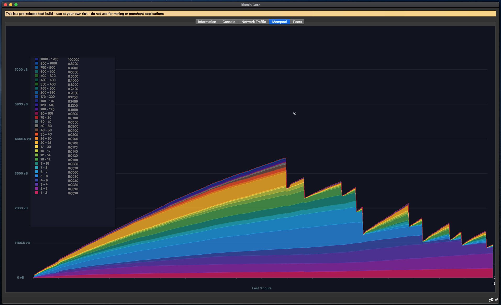

## Mempool-Tab (Experimental)

### This topic repo contains experimental work on a mempool tab in the debug window of Bitcoin-Qt gui application. Consider this code unstable and use at your own risk. It is based on [bitcoin-core/gui](https://github.com/bitcoin-core/gui/commits/master) - [commit - 1e7564eca8a688f39c75540877ec3bdfdde766b1](https://github.com/bitcoin-core/gui/commit/1e7564eca8a688f39c75540877ec3bdfdde766b1).

Original work: [2020/03/mempool_graph](https://github.com/RandyMcMillan/mempool-tab/commit/42b451ebf1ef85458af96d8d7736c1b9c4ec248a) by [jonasschnelli](https://github.com/jonasschnelli/bitcoin/tree/2020/03/mempool_graph)

